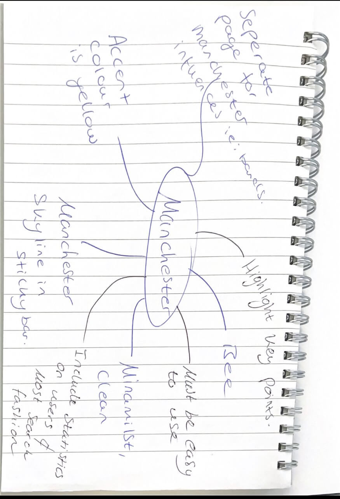
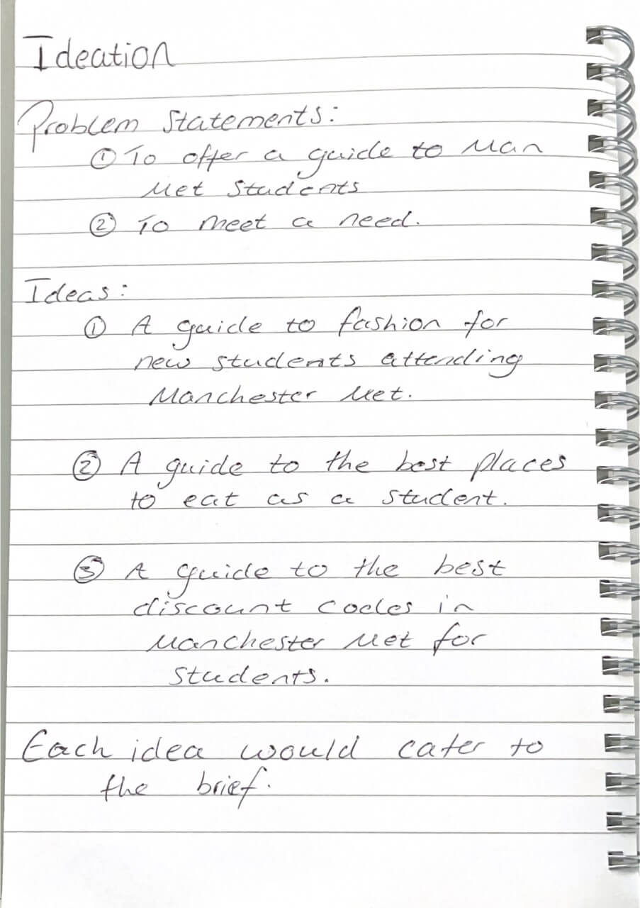

# Ideation Report

**Word count** 300 words maximum

We used a variety of techniques during our ideation process including a mind map and lists for each broken down section of this project. We started with working out our goal and problem statements and identified we wanted to create a guide for the students who attend Manchester Metropolitan University. We then started to brainstorm different guides we could create and came up with 3 main ideas. Through discussion we decided that our team’s skill set best catered towards offering a fashion guide for new and returning students that is specific to the Manchester fashion scene. From there we created a mind map with branding ideas and identified what Manchester meant to us. We highlighted key symbols and phrases that are common for Manchester and concluded we wanted to include a bee in our logo, the colours yellow and black to match a lot of the university’s branding and a common and friendly Manchurian phrase of our kid as the website’s names. 


This process aided us in defining what we wanted to do and what specifics we wanted to include in design and branding. It helped us identify our strengths as a group and understand what role we could all play in creating this website. 


We were able to identify our top 3 ideas that would offer a variety of materials in a short amount of time. This allowed us to start work on each idea until we agreed our strongest approach. 


We investigated offering discount codes, a guide to trendy shops, what is the biggest trends and popular fashion genres seen in the city. We also identified areas we could provide statistics about our users to benefit our users, such as popular trends provided in table form. 


Put your media in the `sp1-media` folder.

Embed the images in the markdown file using either of these methods.







```

```


```

```
